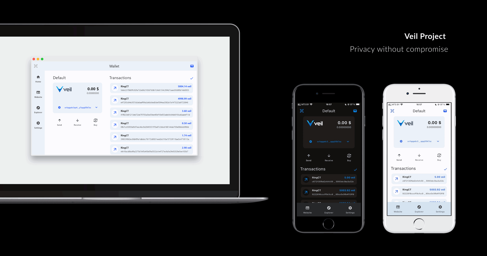

# Veil light wallet [](https://github.com/steel97/veil_wallet/actions/workflows/build.yaml)
<p align="center">

A crossplatform veil light wallet written with dart/flutter.<br>
<a href="https://www.freepik.com/free-psd/smartphone-laptop-black-background-mock-up_1195596.htm#page=2&position=10&from_view=author&uuid=1256c317-acf8-4659-9eba-d4f90287b777">Image by aleksandr_samochernyi</a> on Freepik
</p>


## Getting Started
[](https://play.google.com/store/apps/details?id=org.veilproject.wallet)

Releases for other platforms can be found [here](https://github.com/steel97/veil_wallet/releases/)

Development versions can be downloaded from [github actions](https://github.com/steel97/veil_wallet/actions)

\* Private keys stored with [flutter_secure_storage](https://pub.dev/packages/flutter_secure_storage), next encryption methods used to secure data:
- [CryptProtectData or Windows Credentials API](https://learn.microsoft.com/en-us/windows/win32/api/dpapi/nf-dpapi-cryptprotectdata) on Windows (encrypted data stored at `%APPDATA%/org.veilproject/veil-wallet/flutter_secure_storage.dat`)
- [Keychain](https://developer.apple.com/documentation/security/keychain_services#//apple_ref/doc/uid/TP30000897-CH203-TP1) on MacOS
- [libsecret](https://wiki.gnome.org/Projects/Libsecret) on Linux
- [Keychain](https://developer.apple.com/documentation/security/keychain_services#//apple_ref/doc/uid/TP30000897-CH203-TP1) on iOS
- [EncryptedSharedPreferences](https://developer.android.com/reference/androidx/security/crypto/EncryptedSharedPreferences) on Android

## Development
### Requirements:
- [dart/flutter](https://docs.flutter.dev/get-started/install)
- [rust + cargo](https://www.rust-lang.org/tools/install)

#### Windows:
- visual studio 2022 with c++ support

#### Linux:
- required libs
```
sudo apt update
sudo apt install libsecret-1-dev clang pkg-config ninja-build libgtk-3-dev cmake
```
- it's highly recommended to NOT install flutter via snap

#### MacOS and iOS:
- `zsh` terminal recommended
- [homebrew](https://brew.sh/)
- cocoapods (can be installed via homebrew)
```
brew install cocoapods
```
- [rust + cargo](https://www.rust-lang.org/tools/install) (do NOT install via homebrew)
- [Xcode](https://apps.apple.com/us/app/xcode/id497799835?mt=12)
- Xcode Command Line Tools
```
xcode-select --install
```

#### iOS:
- iOS simulator for Xcode

#### Android:
- [JDK 19](https://jdk.java.net/19/) (FYI: google play release builds are made with [openjdk 21](https://jdk.java.net/21/) under windows platform)
- [SDK](https://developer.android.com/tools/releases/platform-tools)
- [NDK](https://developer.android.com/ndk)
- or install both sdk and ndk via [Android studio](https://developer.android.com/studio)

#### IDE:
Project developed with [VS Code](https://code.visualstudio.com/)

### Building project:
Before building it's important to download submodules
```
git submodule update --init --recursive
```

Also see requirements for [veil_light_plugin](https://github.com/steel97/veil_light_plugin)

You may find solutions for common problems here: [flutter-notes.md](docs/flutter-notes.md)

#### Windows:
```
# release
flutter build windows --release
```

#### MacOS:
```
# release
flutter build macos --release
# after that you may open project in Xcode (./macos/Runner.xcworkspace)
```

#### Linux:
```
# release
flutter build linux --release
```

#### iOS:
```
# release
flutter build ios --release --no-codesign
# after that you may open project in Xcode (./ios/Runner.xcworkspace)
```

#### Android:
```
# debug on device
flutter run -d <device_id>

# release build in aab format
flutter build appbundle --release

# release build in apk format
flutter build apk --release
```

## Developing
Updating `veil_light_plugin` dependency
```
git submodule update --remote --merge ./submodules/veil_light_plugin
```

Viewing logs:
```
flutter logs
```

## Design notes
To generate icons for platforms use:
```
dart run flutter_launcher_icons
```
You may also look at generator config [flutter_launcher_icons.yaml](flutter_launcher_icons.yaml)

## Localization
App uses **arb** format for localization. User locale detected automatically on app start.

To add new locale you should create file:
```
./lib/l10n/app_<lang_code>.arb
```
You can use [./lib/l10n/app_en.arb](lib/l10n/app_en.arb) or [./lib/l10n/app_ru.arb](lib/l10n/app_ru.arb) as a template

\* [app_en.arb](lib/l10n/app_en.arb) contain some metadata which is not required for other languages, you may safely remove it (see [app_ru.arb](lib/l10n/app_ru.arb) for example)

## Donate
My veil address: sv1qqp3twtj249e226mvg55jm0ec36y99xsh5ytnm6hcgvetthuptj2kugpqwcnw6tpnvwrrvutsltnghkg46ayqpw40g6p3knppy3kwgvhr34mkqqqeedkfp